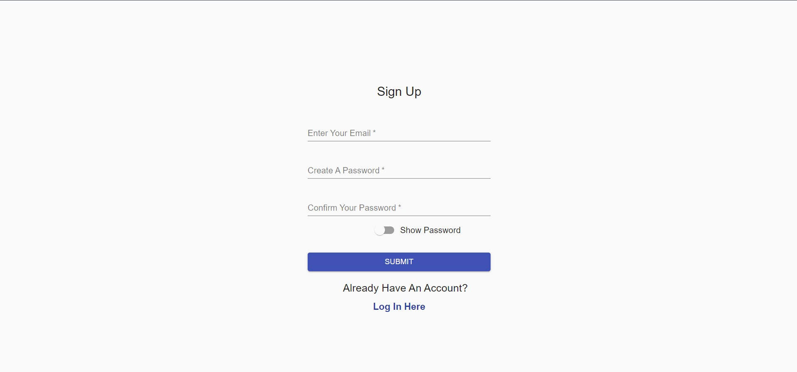

# Sendex: A Chat Application

## About

The project was built using React.js for the front-end and firebase for the back-end. 

### Stack

- JavaScript, React
- Node.js, npm
- Firebase, including authentication, hosting, and Firestore

### Get it running

`npm install`
Install dependencies.

`npm start`
Run for development

### Examples

  

  

  

### RoadMap

* Integrating video chat
* Group conversations

